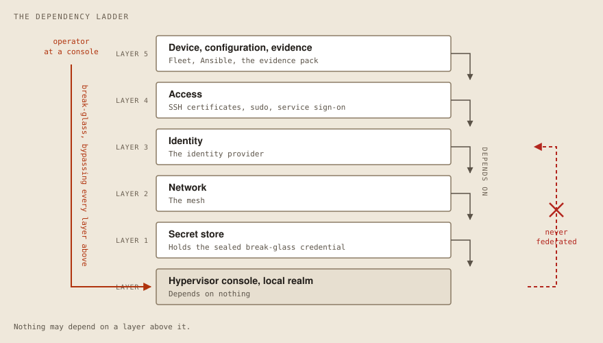
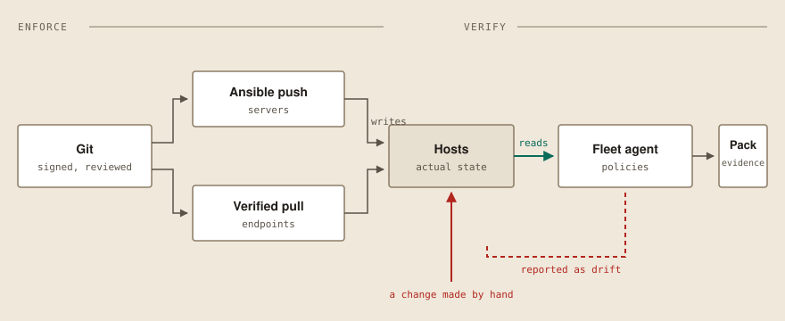

# Linux Estate Reference Architecture

A working reference for running Linux servers and desktops the way the rest of a
company's fleet is already run: identity in one place, devices enrolled and
verifiable, access that ends when someone leaves, and evidence you can hand to
whoever asks for it.

Everything here is open source, deployed by Terraform and Ansible, and designed
so that no part of it depends on the person who set it up.

---

## The problem this addresses

Most organizations above a hundred or so people already run an operating model.
Identity lives in an identity provider. Devices are enrolled in something.
There is a patch process, an endpoint agent, and an evidence trail for whoever
asks.

Then there is Linux. Hand-built servers, hypervisors with local root accounts,
and workstations that were installed by the person sitting at them and never
made it into the fleet. Not because anyone was careless — below a certain size
it isn't a full-time role, and it falls outside what the incumbent tools cover
well.

The result is a population of machines inside a managed company that is not
managed: not enrolled, not patched on a schedule, not in the identity system,
and not covered by whatever the endpoint standard says. This is a governance
gap that already exists rather than a technology anyone needs to adopt.

**This repository is what closing that gap looks like, in code.**

## The shape of it

The identity provider is a server inside the estate it governs, which produces
the failure this architecture is arranged to survive: the identity provider is
down, logging into the hypervisor requires the identity provider, and starting
the identity provider requires logging into the hypervisor.

Most reference architectures draw identity at the bottom of the diagram, which
is exactly where that circularity hides. Drawing it truthfully means declaring,
per layer, what it may depend on — and never crossing the line.

The hypervisor keeps a local administrative realm permanently and is never
federated. The change that would "finish the job" is the one that makes the
estate unrecoverable, and it always looks like an improvement in the pull
request. Full treatment in [`docs/00-overview.md`](docs/00-overview.md).

The second structural idea is that configuration is **enforced** by one system
and **verified** by another:

A configuration tool reporting that it applied a change is reporting on its own
behavior, not on the machine's state — it will report success on a host where
the change was reverted an hour later. Evidence comes from the path that had no
hand in making the change, which is also what gives drift a definition: the
enforcing system says what should be true, the verifying system says what is,
and the gap between them is a number somebody can be accountable for.

## What this is

- **An architecture**, in `docs/` — the seven planes, what depends on what, the
  decisions taken and the alternatives rejected, each with a written reason.
- **A control catalog**, in `controls/` — 36 numbered controls, each stating
  what it requires, which SOC 2 Trust Services Criterion it serves, what
  implements it, and **what verifies it**.
- **The implementation**, in `terraform/` and `ansible/` — deployable, with no
  manual steps in the path.
- **An evidence generator**, in `evidence/` — producing the artifact that
  answers a customer security questionnaire from what the estate actually
  reports, rather than from what someone believes.
- **A lab**, in `lab/` — the whole estate stood up from nothing, so this can be
  tried before it is trusted.

## What this is not

- **Not a compliance certification, and it cannot produce one.** This generates
  evidence for the questions SOC 2 asks. An auditor issues attestations; this
  repository does not, and any wording suggesting otherwise fails CI.
- **Not MDM for Linux.** There is no MDM protocol for Linux. What exists is an
  agent plus configuration management, and this architecture says so plainly
  rather than borrowing a word that implies more than it delivers.
- **Not a product, and not a dependency.** There is nothing here that stops
  working if you stop talking to whoever set it up. That is a design
  constraint, not a courtesy.
- **Not a hardening checklist.** Plenty of those exist and they are useful. This
  is about the operating model — how access is granted and removed, how
  machines get configured, and how you would prove any of it.

## Start here

| If you want to | Read |
|---|---|
| Understand the shape of it | [`docs/00-overview.md`](docs/00-overview.md) |
| Know what it claims and how each claim is checked | [`controls/`](controls/) |
| Know why something was chosen | [`docs/adr/`](docs/adr/) |
| Try it without touching anything you care about | [`lab/`](lab/) |
| Onboard or offboard a person | [`docs/runbooks/`](docs/runbooks/) |

## Status

Early. The architecture and the control catalog are written; the
implementation is being built against the lab, milestone by milestone. Control
status is stated per control and is not aspirational — `planned` means planned.

One control is currently `implemented`: **IGN-SC-01**, which requires that
nothing executes unless its source is signed and verified. It is implemented
against this repository itself. A project that documents provenance while
accepting unsigned commits would be arguing against itself.

## Contributing

Commits must be signed, and your key must be in
[`.allowed_signers`](.allowed_signers) in the same pull request as your first
one. See [`docs/06-provenance.md`](docs/06-provenance.md) for why that rule
applies to this repository and not only to the estates it describes.

## License

Apache-2.0. See [`LICENSE`](LICENSE).
